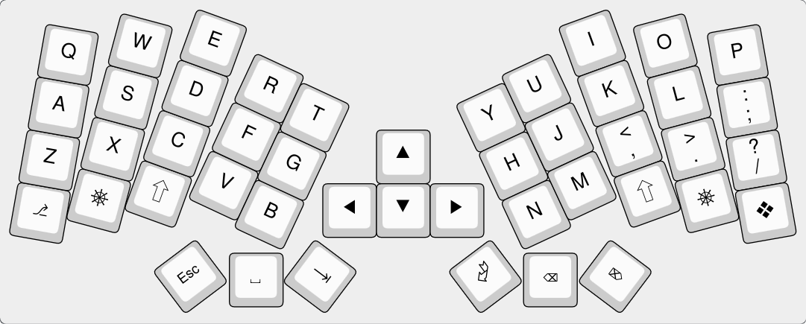
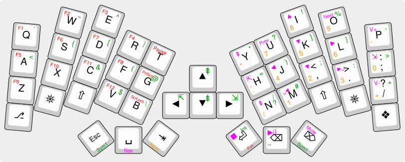
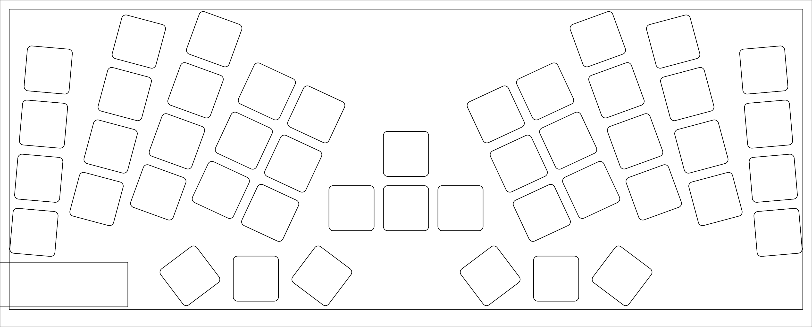

# HandyWork 5x3 with modifier keys and central navigation keys

## Example keymap

With layers:

## Physical layout

[Printable test layout](HandyWork-5x3-with-mods-with-nav-layout.pdf)

Fits Framework 16 A1 design space.

## PCB

## Ordering yourself for production

The parameters and order flow are described on the [v1A tag](https://github.com/AxelVoitier/keebs/releases/tag/HandyWork-5x3-Mods-Nav-v1A) itself
