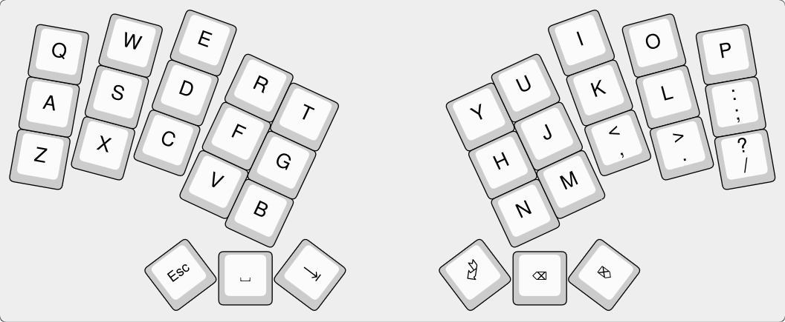
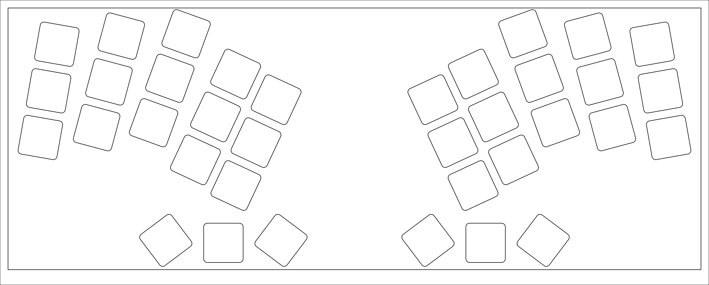
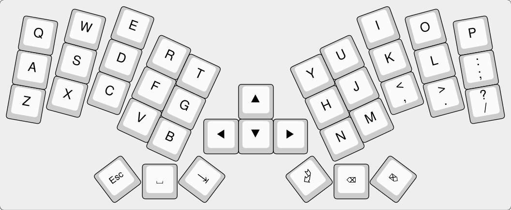
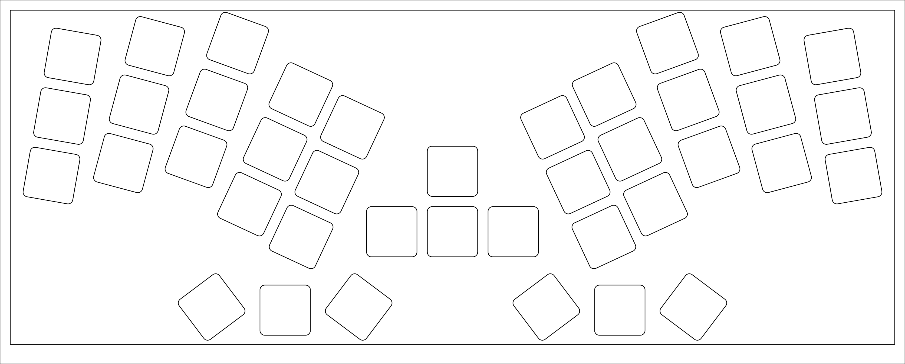
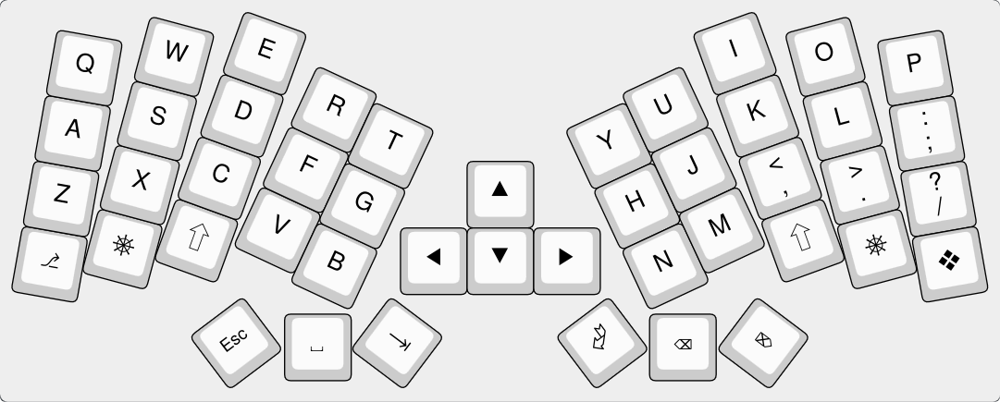
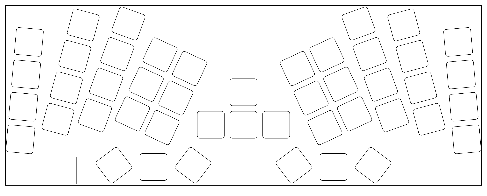
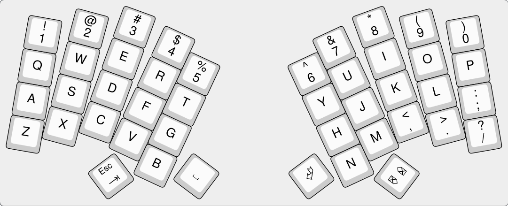
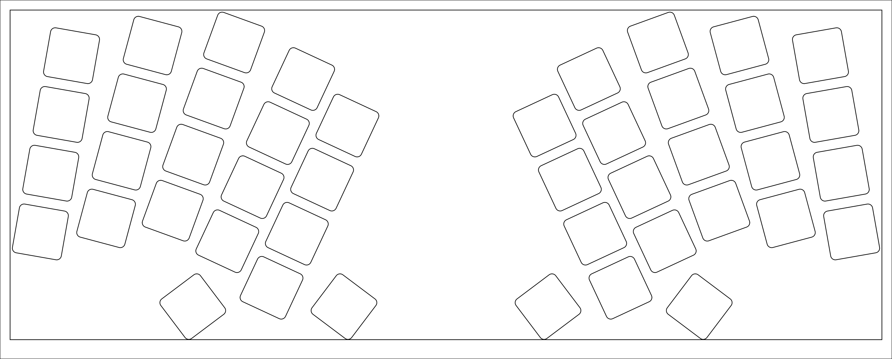
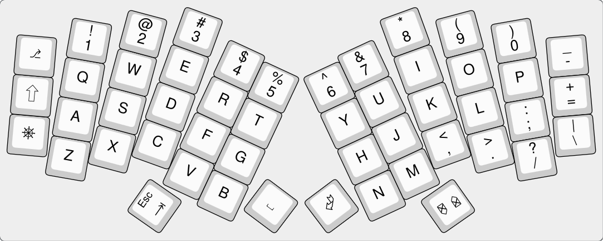
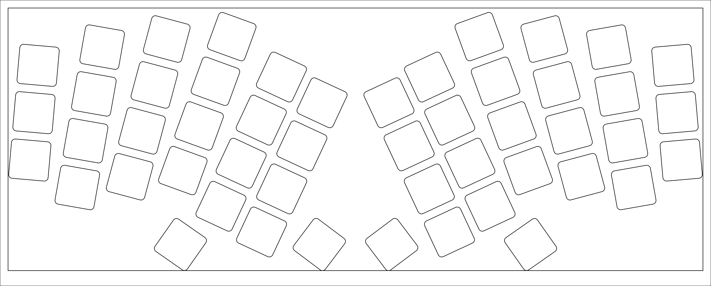

# Ergo keyboards for the Framework 16

## Main properties of HandyWork

- Mimics a split ergo but as a unibody fitting on the Framework 16 using One Key Modules
- Design pipeline flexible enough to propose variations: 5x3, 5x4, 6x3, 6x4, with or without extra keys
- Staggered columns using offsets found in various popular design. Baseline column offsets are:
  - Index inner: -2.5 mm (from Kyria)
  - Index: 0 (reference column)
  - Middle: +6.5 mm (from Kyria)
  - Ring: -(4 / 25) U (ie. ~ -3.05 mm, from YAEMK)
  - Pinky: -(5 / 7) U (ie. ~ -13.61 mm, from YAEMK)
  - Pinky outer: -25 mm (from Handy)
- 25 degrees angle for each hand
- Splayed middle, ring, pinky and outer columns
  - 5-10-15-20 in absolute angles,
  - or 5-5-5-5 in relative (ie. stacked) angles

## Variants

> [!NOTE]
> These are *proposed* layouts for now. Not all are meant to be supported in the long term, and a selection will have to be made (aiming for 2 or 3 only).

| Look / Printable layout | Description | Pros / Cons |
| ----------------------- | ----------- | ----------- |
|    | **[5x3](HandyWork-5x3)**  A minimalist 5 columns * 3 rows, plus 3 keys thumb cluster, per hand  36 keys | + Typical layout for the popular [Miryoku](https://github.com/manna-harbour/miryoku) keymap design + Small comfortable hand movements  - Hard to learn because:  - Nearly everything beside the alphas is behind layers - Home row modifiers are tricky  |
|    | **[5x3-with-mods](HandyWork-5x3-with-mods)**  Like 5x3, but with 3 keys added on each outer side at the bottom for direct access to modifiers  42 keys | + Solve the home row modifiers issue for those that cannot get used to it  - Still many layers |
|    | **[5x3-with-nav](HandyWork-5x3-with-nav)**  Like 5x3, but with dedicated navigation keys in the middle  40 keys | + Navigation keys are direct (ie. not behind a layer)  - Still many layers - Home row modifiers are tricky - Navigation requires hand movements instead of just finger movement |
|    | **[5x3-with-mods-with-nav](HandyWork-5x3-with-mods-with-nav)**  A 5x3 with both dedicated modifiers and navigation keys  46 keys | + Solve the home row modifiers issue for those that cannot get used to it + Navigation keys are direct (ie. not behind a layer)  - Still many layers - Navigation requires hand movements instead of just finger movement |
|    | **[5x4](HandyWork-5x4)**  Adds a number row to 5x3. Becomes 5 columns * 4 rows, plus 2 keys thumb cluster, per hand  44 keys | + Great for those that cannot do without a number row + Less layers needed for most special characters and numbers  - One less key in the thumb cluster - Home row modifiers are tricky |
|    | **[5x4-with-nav](HandyWork-5x4-with-nav)**  Like 5x4, but with dedicated navigation keys in the middle  48 keys | + Great for those that cannot do without a number row + Less layers needed for most special characters, numbers, and navigation  - One less key in the thumb cluster - Home row modifiers are tricky |
|    | **[6x3](HandyWork-6x3)**  Adds a second pinky column to 5x3. Becomes 6 columns * 3 rows, plus 3 keys thumb cluster, per hand  42 keys | + These outer keys are typically used for modifiers, or very often used special characters  - Depends on what you choose to NOT put on these outer keys |
|    | **[6x4](HandyWork-6x4)**  Adds a partial (only 3 keys) second pinky column to 5x4. Becomes 5 columns * 4 rows, plus 2 keys thumb cluster, plus 3 keys outer pinky, per hand. Layout with the most keys.  50 keys | + Great for those that cannot do without a number row + Less layers needed for most special characters and numbers + These outer keys are typically used for modifiers, or very often used special characters  - One less key in the thumb cluster - Greater hand movements overall |

## Source files organisation

A special pipeline is used to get to these results. Since the software setup is currently not very user friendly, I have committed not only the source files, but also the generated ones.

For each variant (ie. sub folder starting with `HandyWork-` here), various YAML files are combined in layers to generate a final one, named `<FOLDER-NAME>.yaml`.
You can take that file and directly input it in [Ergogen](https://ergogen.xyz/) to visualise and play around with each layout.

Another file named `<FOLDER-NAME>.json` is generated, and can be directly imported into [Keyboard Layout Editor NG](https://editor.keyboard-tools.xyz/) to edit the keymap.

I actually don't do editing in these tools, but rather directly in the layered YAML source files. The same source YAML files will later be used to generate the skeleton of the PCB, as well as the firmware files.

## Note on the printable layouts

A typical A4 paper in landscape (297 mm * 210 mm) is enough to fit the Framework 16 A1 design space (283.16 mm * 114.35 mm). The printable layouts show a frame for both this outer design space (the one for H 0mm), as well as the inner one (the one for H 1.35mm, 276.76 mm * 105 mm) that can receive the One Key Module full height (ie. the keycap).

Those should be to scale, in theory. However, most printers introduce a small scaling variation. If you print on something else than A4 you might also end up with a very different scale.

If you really care about getting the scaling right, print one, then measure the height of the inner frame on one of the side. It should be 105 mm. If not, take that measurement, and divide 105 by it, then multiply by 100. This will give you a scaling factor in percent that most application/printer driver allows you to input in their print settings.
