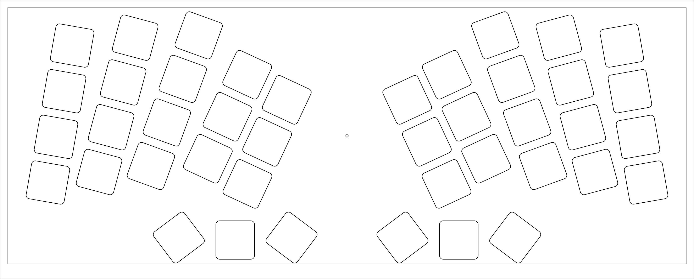

# Split ergo keyboards for the Framework 16

## Handywork-min

A 5x3 for the alpha keys, with a 3x1 thumb cluster, and 3x1 keys for mods.

[Printable test layout](Test%20prints/5x3-3x1-3x1--01.pdf)
